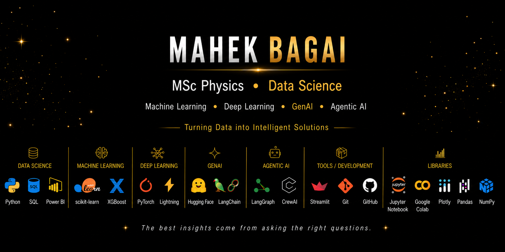

  

# Hi, I'm Mahek Bagai 👋

🎓 **MSc Physics Student** • 💻 **Data Science Enthusiast** • 🤖 **AI Explorer**

## 👩‍💻 About Me

🎓 MSc Physics student passionate about Data Science and Artificial Intelligence.

💡 I enjoy turning data into intelligent solutions by building end-to-end Machine Learning applications and exploring modern AI technologies.

🚀 Currently learning and building projects in Deep Learning, NLP, Generative AI, and Agentic AI.

---

## 💻 Tech Stack

### Programming Languages

### Data Science & Visualization

### Machine Learning & AI

### LLM Ecosystem

**Open-source**

**Closed-source APIs**

### Development Tools

---

## 🚀 Featured Projects

> 🚧 Currently organizing my best projects. Stay tuned!

---

## 🌱 Currently Learning

- Deep Learning
- Natural Language Processing (NLP)
- Generative AI
- Agentic AI
- LLM Applications
- AI Workflows

---

## 🌐 Connect with Me

---

> *"The best insights come from asking the right questions."*

---

⭐ **Learning. Building. Growing.**
